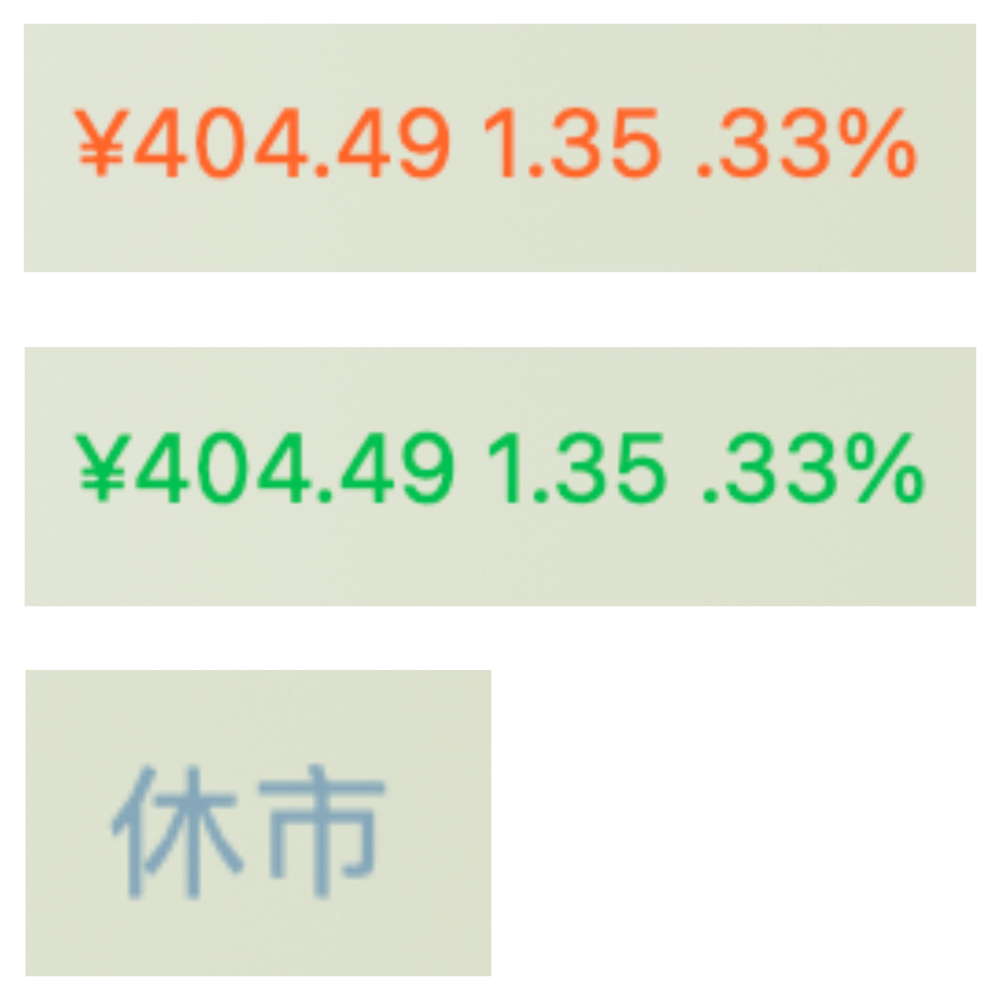

京东民生积存金 xbar/Swiftbar 插件，可以在macOS状态栏中显示实时积存金价格、涨跌幅值及百分比。

# 使用说明
本插件依赖`bash、jq、bc`，其中`bash、bc`应该是系统自带的，需要手动安装`jq`，推荐使用[brew](https://brew.sh/index_zh-cn)安装：`brew install jq`。

然后安装 [Swiftbar](https://github.com/swiftbar/SwiftBar) 或 [xbar](https://github.com/matryer/xbar)，推荐使用Swiftbar：`brew install --cask swiftbar`。

安装完成后设置插件目录，然后将脚本插件`JD_Gold.5s.sh`放置于插件目录中，并授予执行权限`chown +x JD_Gold.5s.sh`，然后打开 xbar/Swiftbar 点击「开启所有插件」

# 显示
本插件每5秒钟获取京东金融中的民生积存金价格，即界面中实时金价栏中的`当前金价`、与今天0点的`价差`、`涨跌幅百分比`。

